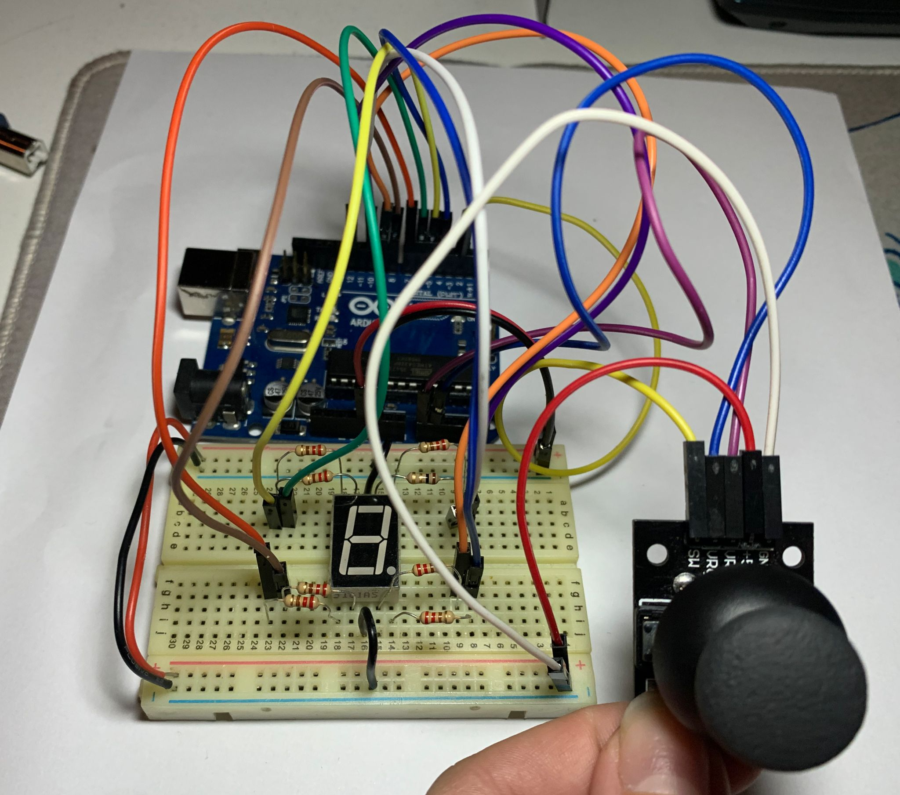

# Introduction To Robotics
This repository contains a collection of hands-on robotics assignments undertaken during my third-year studies at the Faculty of Mathematics and Computer Science, University of Bucharest. Each assignment in this repository provides clear requirements, detailed implementation instructions, and includes the code and image files necessary.

<details>
<summary>RGB LED Control Using Potentiometers</summary>
<br>
The first assignment focuses on learning how to control the colors of an RGB LED light using potentiometers. Think of an RGB LED as a tiny, controllable traffic light, where you can make it show any color you want. Potentiometers are like knobs that let you adjust the amount of red, green, and blue light the LED gives off. By turning these knobs, you can create different colors, and even mix them to create unique ones.

The components used are:
* Microcontroller (Arduino UNO)
* Breadboard
* RGB Led (at least 1)
* Potentiometers (at least 3)
* Resistors & jumper wires (as needed)

<p align="center">
  
</p>

Here's how it works:

* You have three potentiometers that you can twist. Each one represents a color channel: Red, Green, and Blue.
* When you turn the red potentiometer, it changes the intensity or brightness of the red light in the LED. Turning it more makes the red color stronger.
* Similarly, turning the green potentiometer changes the intensity of the green light, and turning the blue potentiometer changes the intensity of the blue light.
* By adjusting the three potentiometers together, you can create different colors. For example, if you turn up the red and green potentiometers while keeping the blue one low, you get a yellowish color. If you turn up only the blue potentiometer, you get a blue color.
  * [Watch the video](https://www.youtube.com/shorts/Y7U4Y1t5gCs) to see this functionality in action.
* The code in your Arduino takes the readings from the potentiometers and uses them to control the LED's colors, so it's like having a set of color knobs for your light. This way, you can experiment and create various colors by blending different amounts of red, green, and blue.

```cpp
/* This code is designed to independently manage the Red, Green, and Blue channels
of an RGB LED by utilizing separate potentiometers for each channel.*/

const int redPin = 11;   //red LED control pin
const int greenPin = 10; //green LED control pin
const int bluePin = 9;   //blue LED control pin

const int redInputPin = A0;    //analog pin for the red input (e.g., potentiometer)
const int greenInputPin = A1;  //analog pin for the green input (e.g., potentiometer)
const int blueInputPin = A2;   //analog pin for the blue input (e.g., potentiometer)

void setup() {
  pinMode(redPin, OUTPUT);
  pinMode(greenPin, OUTPUT);
  pinMode(bluePin, OUTPUT);
}

void loop() {
  //read the values from the potentiometers
  int redValue = analogRead(redInputPin);
  int greenValue = analogRead(greenInputPin);
  int blueValue = analogRead(blueInputPin);

  //map the potentiometer values to the range 0-255 for PWM
  int redBrightness = map(redValue, 0, 1023, 0, 255);
  int greenBrightness = map(greenValue, 0, 1023, 0, 255);
  int blueBrightness = map(blueValue, 0, 1023, 0, 255);

  //update the RGB LED with the new brightness values
  analogWrite(redPin, redBrightness);
  analogWrite(greenPin, greenBrightness);
  analogWrite(bluePin, blueBrightness);
}
```
</details>

<details>
<summary>Elevator Simulator</summary>
<br>
This assignment is about designing a control system that simulates a 3-floor elevator using the Arduino platform. 
The components used are:
* Microcontroller (Arduino UNO) & Breadboard
* 3 LEDs (for floor indicators)
  * each of the three LEDs symbolises one of the three floors, the LED aligned with the current floor should illuminate
* 1 LED (for operational state)
  * this LED indicates the elevator's status, blinking when the elevator is in motion and remain turned on when it's not moving.
* 3 Push Buttons (for call buttons)
  * they act as call buttons for the three different floors. Upon pressing any of these buttons, the elevator should mimic the process of moving toward the selected floor, which occurs after a brief delay of around 2-3 seconds. 
* 1 Buzzer
  * when the elevator reaches the requested floor, the buzzer emits a short sound similar to a "cling!"
  * when the elevator doors close and it starts moving
* Resistors (220-330 Ohms for LEDs) & Jumper Wires

<p align="center">
  
</p>

The code continuously checks the status of the call buttons, and when a button is pressed, it initiates elevator movement to the desired floor. The elevator doors open and close with corresponding buzzer sounds. During the elevator's movement, the operational LED blinks to indicate motion, and the buzzer emits a sound similar to an elevator that is in motion. Floor indicator LEDs show the current floor by lighting up. 

[Watch the video](https://www.youtube.com/shorts/97vl4IrVoe4) to see this project in action.

```cpp
const int floorLeds[] = {2, 3, 4};  //digital pins for floor indicator LEDs
const int operationalLed = 5;       //digital pin for the operational state LED
const int buzzerPin = 6;            //digital pin for the buzzer
const int buttonPins[] = {7, 8, 9}; //digital pins for call buttons

int currentFloor = 1; //current floor of the elevator
const int delayTime = 1000;

bool isMovingToFloor = false;
int targetFloor = -1;

int buzzTone = 1000;
const int soundDuration = 500;

const int debounceDelay = 100;
unsigned long lastDebounceTime[] = {0, 0, 0};
bool buttonState[] = {false, false, false};
bool lastButtonState[] = {false, false, false};

byte ledState = HIGH; //could be bool
unsigned long previousMillis = 0;
const long interval = 500; //interval at which to blink (milliseconds)

void setup() {
  for(int i=0; i<3; i++) {
    pinMode(floorLeds[i], OUTPUT);
    pinMode(buttonPins[i], INPUT_PULLUP);
  }

  digitalWrite(floorLeds[0], HIGH); 
  digitalWrite(floorLeds[1], LOW);
  digitalWrite(floorLeds[2], LOW);

  pinMode(operationalLed, OUTPUT);
  digitalWrite(operationalLed, HIGH);

  pinMode(buzzerPin, OUTPUT);
}

void loop() {
  for(int i=0; i<3; i++) {
    int reading = digitalRead(buttonPins[i]);

    if(reading != lastButtonState[i]) {
      lastDebounceTime[i] = millis();
    }

    if((millis() - lastDebounceTime[i]) > debounceDelay) {
      if(reading != buttonState[i]) {
        buttonState[i] = reading;
        if(buttonState[i] == LOW) {
          handleButtonPress(i + 1);
        }
      }
    }

    lastButtonState[i] = reading;
  }
}

void handleButtonPress(int desiredFloor) {
  if(desiredFloor == currentFloor || (isMovingToFloor && desiredFloor == targetFloor)) {
    //elevator is already on the desired floor or it's already moving to that floor
    return;
  }

  if(!isMovingToFloor) {
    //if the elevator is not already moving, initiate the movement
    targetFloor = desiredFloor;
    isMovingToFloor = true; //elevator has started moving
    
    doorsSound();
    delay(delayTime); //doors closing
    
    moveElevator(targetFloor);
    doorsSound(); //doors opening
    digitalWrite(operationalLed, HIGH);

    isMovingToFloor = false; //elevator has stopped moving
  }
}

void moveElevator(int floor) {
  unsigned long lastFloorTime = 0;
  const unsigned long floorChangeInterval = 2000; //2 seconds between floors

  //simulate elevator movement to the target floor
  if (floor > currentFloor) {
    for (int i = currentFloor; i < floor; i++) {
      currentFloor = i + 1;
      lastFloorTime = millis();
      while (millis() - lastFloorTime < floorChangeInterval) {
        elevatorMovingSound();
        blinkOperationalLED();
      }
      updateFloorIndicators();
      
    }
  }else if(floor < currentFloor) {
    for(int i = currentFloor; i > floor; i--) {
      currentFloor = i - 1;
      lastFloorTime = millis();
      while (millis() - lastFloorTime < floorChangeInterval) {
        elevatorMovingSound();
        blinkOperationalLED();
      }
      updateFloorIndicators();
    }
  }

  // Simulate elevator doors
  doorsSound();
  delay(delayTime); //pause
}


void updateFloorIndicators() {
  for (int i=0; i<3; i++) {
    digitalWrite(floorLeds[i], i + 1 == currentFloor ? HIGH : LOW);
  }
}

void doorsSound() {
  tone(buzzerPin, 440, soundDuration); //sound for elevator doors opening/closing
}

void elevatorMovingSound() {
  tone(buzzerPin, 1000); //sound the buzzer at 1000 Hz while moving
}

void blinkOperationalLED() {
  unsigned long currentMillis = millis();
  if (currentMillis - previousMillis >= interval) {
    //save the last time the LED state was toggled
    previousMillis = currentMillis;

    //toggle the LED state (HIGH to LOW, or LOW to HIGH)
    if (ledState == HIGH) {
      ledState = LOW;
    } else {
      ledState = HIGH;
    }

    digitalWrite(operationalLed, ledState);  // Apply the new LED state
  }
}
```
</details>

<details>
<summary>7 segment display drawing</summary>
<br>
This project uses a joystick and a button to control a 7 segment display. The joystick allows you to move a segment around the display, like drawing with a virtual pen. You can't move through "walls," so it jumps to neighboring spots. The button lets you turn the segment on or off with a quick press. If you hold the button down for a while, it clears the display and puts the segment back at the starting point.

<p align="center">
  
</p>

Components used:
* Microcontroller (Arduino UNO) & Breadboard
* 1 7-Segment Display
* 1 Joystick
* Resistors (220-330 Ohms for LEDs) & Jumper Wires

Movement table:

| Current segment  |  UP  | DOWN | LEFT | RIGHT |
| ---------------- | ---- | ---- | ---- | ----- |
|        a         | N/A  |   g  |  f   |   b   |
|        b         |  a   |   g  |  f   |  N/A  |
|        c         |  g   |   d  |  e   |  dp   |
|        d         |  g   | N/A  |  e   |   c   |
|        e         |  g   |   d  | N/A  |   c   |
|        f         |  a   |   g  | N/A  |   b   |
|        g         |  a   |   d  | N/A  |  N/A  |
|       dp         | N/A  | N/A  |  c   |  N/A  |

The following code begins by declaring pin connections for the joystick (analog inputs for X and Y axes and a digital input for the switch) and the 7-segment display (an array of pins for segments and a pin for the decimal point). The code initializes the display and continuously reads the joystick input, allowing you to move a selected segment's position on the display based on the joystick's X and Y values. It also handles button presses: short presses toggle the state of the current segment (ON or OFF), and long presses reset the entire display. The code supports both common anode and common cathode displays.

[Watch the video](https://www.youtube.com/shorts/4OSbZHWYBVo) to see this project in action.

```cpp
// Declare all the joystick pins
const int pinSW = 2; // Digital pin connected to switch output
const int pinX = A0; // A0 - Analog pin connected to X output
const int pinY = A1; // A1 - Analog pin connected to Y output

// Declare all the segments pins
const int pinA = 12;
const int pinB = 10;
const int pinC = 9;
const int pinD = 8;
const int pinE = 7;
const int pinF = 6;
const int pinG = 5;
const int pinDP = 4;

const int segSize = 8;
int index = 7; // Start at the decimal point position

bool commonAnode = false;
const int noOfDigits = 10;
byte state = HIGH;
byte dpState = LOW;
byte swState = LOW;
byte lastSwState = LOW;
int xValue = 0;
int yValue = 0;

bool joyMoved = false;
int digit = 0;

int segments[segSize] = {
  pinA, pinB, pinC, pinD, pinE, pinF, pinG, pinDP
};

unsigned long lastButtonPressTime = 0;
unsigned long longPressDelay = 1000;

void setup() {
  // Initialize pins
  for (int i = 0; i < segSize; i++) {
    pinMode(segments[i], OUTPUT);
  }

  pinMode(pinSW, INPUT_PULLUP);

  if (commonAnode == true) {
    state = !state;
  }
}

void loop() {
  // Read joystick values
  xValue = analogRead(pinX);
  yValue = analogRead(pinY);

  // Handle joystick movement
  handleJoystickMovement();

  // Handle button press
  handleButtonPress();

  // Update display based on the current position and segment states
  updateDisplay();
}


void handleJoystickMovement() {
  int xThreshold = 350;
  int yThreshold = 650;

  // Read joystick values and apply threshold to reduce noise
  int xChange = analogRead(pinX) - 512; 
  int yChange = analogRead(pinY) - 512; 

   // Switch based on the current position
  switch (index) {
    case 0: // a
      if (xChange == 1) { // RIGHT input
        index = 1; // go to b
      } else if (xChange == -1) { // LEFT input
        index = 5; // go to f
      } else if (yChange == -1) { // DOWN input
        index = 6; // go to g
      }
      break;

    case 1: // b
      if (yChange == 1) { // UP input
        index = 0; // go to a
      } else if (xChange == -1) { // LEFT input
        index = 5; // go to f
      } else if (yChange == -1) { // DOWN input
        index = 6; // go to g
      }
      break;

    case 2: // c
      if (xChange == -1) { // LEFT input
        index = 4; // go to e
      } else if (yChange == 1) { // UP input
        index = 6; // go to g
      } else if (yChange == -1) { // DOWN input
        index = 3; // go to d
      } else if (xChange == 1) { // RIGHT input
        index = 7; // go to dp
      }
      break;

    case 3: // d
      if (xChange == 1) { // RIGHT input
        index = 2; // go to c
      } else if (yChange == 1) { // UP input
        index = 6; // go to g
      } else if (xChange == -1) { // LEFT input
        index = 4; // go to e
      }
      break;

    case 4: // e
      if (xChange == 1) { // RIGHT input
        index = 2; // go to c
      } else if (yChange == -1) { // DOWN input
        index = 3; // go to d
      } else if (yChange == 1) { // UP input
        index = 6; // go to g
      }
      break;

    case 5: // f
      if (yChange == 1) { // UP input
        index = 0; // go to a
      } else if (yChange == -1) { // DOWN input
        index = 6; // go to g
      } else if (xChange == -1) { // RIGHT input
        index = 1; // go to b
      }
      break;

    case 6: // g
      if (yChange == 1) { // UP input
        index = 0; // go to a=5t
      } else if (yChange == -1) { // DOWN input
        index = 3; // go to d
      }
      break;

    case 7: // dp
      if (xChange == -1) { // LEFT input
        index = 2; // go to c
      }
    break;
  }

  // Reset the flag if there is no joystick movement
  if (abs(xChange) <= xThreshold && abs(yChange) <= yThreshold) {
    joyMoved = false;
  }
}

void handleButtonPress() {
  swState = digitalRead(pinSW);

  // Handle short button press to toggle segment state
  if (swState == LOW && lastSwState == HIGH) {
    // Toggle the state of the current segment
    if (digitalRead(segments[index]) == HIGH) {
      digitalWrite(segments[index], LOW);
    } else {
      digitalWrite(segments[index], HIGH);
    }
  }

  // Handle long button press to reset display
  if (swState == LOW && millis() - lastButtonPressTime >= longPressDelay) {
    // Reset the entire display
    for (int i = 0; i < segSize; i++) {
      digitalWrite(segments[i], LOW);
    }
    index = 7; // Move back to the decimal point
    lastButtonPressTime = millis(); // Reset the timer
  }

  lastSwState = swState;
}

void updateDisplay() {
  for (int i = 0; i < segSize; i++) {
    // Turn off all segments
    digitalWrite(segments[i], LOW);
  }

  // Make the current position blink
  if (millis() % 1000 < 500) {
    digitalWrite(segments[index], HIGH); // Turn on the current position
  } else {
    digitalWrite(segments[index], LOW); // Turn off the current position during the other half of the blink cycle
  }
}
```
</details>

<details>
<summary>Stopwatch Timer</summary>
<br>
The assignment involves creating a stopwatch timer using an Arduino microcontroller and a 4-digit 7-segment display. The timer should count in tenths of a second and include functionalities such as start/stop, lap time recording, and display updates. The lap time feature saves up to 4 laps, with the ability to override the first lap time when the limit is reached. Button debouncing is implemented to ensure accurate input recognition. The code utilizes multiplexing to display the timer on the 7-segment display and includes features such as clearing the display to prevent ghosting. 

Components:
* Microcontroller (Arduino UNO) & Breadboard
* 1 4 digit 7-Segment Display
* 1 Shift Register (74HC595)
* 3 Buttons
* Resistors (220-330 Ohms for LEDs) & Jumper Wires

<p align="center">
  
</p>

[Watch the video](https://www.youtube.com/shorts/4OSbZHWYBVo) to see this project in action.

```cpp
// DS = [D]ata [S]torage - data
// STCP = [ST]orage [C]lock [P]in latch
// SHCP = [SH]ift register [C]lock [P]in clock

const byte latchPin = 11; // STCP to 12 on Shift Register
const byte clockPin = 10; // SHCP to 11 on Shift Register
const byte dataPin = 12; // DS to 14 on Shift Register

// Pin assignments for controlling the common cathode/anode pins of the 7-segment digits
const byte segD1 = 4;
const byte segD2 = 5;
const byte segD3 = 6;
const byte segD4 = 7;

// Size of the register in bits
const byte regSize = 8;

// Array to keep track of the digit control pins
byte displayDigits[] = {
  segD1, segD2, segD3, segD4
};
const byte displayCount = 4; // Number of digits in the display
const int encodingsNumber = 10; // Number of different character encodings

byte byteEncodings[encodingsNumber] = {
  // Encoding for segments A through G and the decimal point (DP)
  //A B C D E F G DP
  B11111100, // 0
  B01100000, // 1
  B11011010, // 2
  B11110010, // 3
  B01100110, // 4
  B10110110, // 5
  B10111110, // 6
  B11100000, // 7
  B11111110, // 8
  B11110110 // 9
};

// Array representing the state of each bit in the shift register
byte registers[regSize];

//Variables for the buttons
const int button1Pin = 3; // START/PAUSE
const int button2Pin = 2; // RESET
const int button3Pin = 8; // SAVE LAP

byte button1State = 0; 
byte button2State = 0;
byte button3State = 0; 

// Stopwatch variables
unsigned long elapsedTime = 0;
bool isRunning = false;
unsigned long lastLapTime = 0;


const int maxLaps = 4; // Maximum number of laps to store
unsigned long lapTimes[maxLaps]; // Array to store lap times
int lapIndex = 0; // Index to keep track of the current lap

unsigned long lastIncrement = 0;
unsigned long delayCount = 100; // Delay between updates (milliseconds)
unsigned long number = 0; // The number being displayed

// Variables for button debouncing
unsigned long lastDebounceTime = 0;
unsigned long debounceDelay = 200; 

unsigned long lastButton2Time = 0;
unsigned long button2DebounceDelay = 200;

unsigned long lastButton3Time = 0;
unsigned long button3DebounceDelay = 200;

// New flag to track if the stopwatch is paused
bool isPaused = false;


void setup() {
  // Initialize the digital pins connected to the shift register as outputs
  pinMode(latchPin, OUTPUT);
  pinMode(clockPin, OUTPUT);
  pinMode(dataPin, OUTPUT);

  // Initialize the digit control pins as outputs and turn them off
  for (byte i = 0; i < displayCount; i++) {
    pinMode(displayDigits[i], OUTPUT);
    digitalWrite(displayDigits[i], LOW);
  }

  // Initialize the button pins
  pinMode(button1Pin, INPUT_PULLUP);
  pinMode(button2Pin, INPUT_PULLUP);
  pinMode(button3Pin, INPUT_PULLUP);


  Serial.begin(9600);
}

void loop() {
  // Read button states
  button1State = digitalRead(button1Pin);
  button2State = digitalRead(button2Pin);
  button3State = digitalRead(button3Pin);

  // Handle button actions
  if (button1State == LOW) { // Start/Stop button
    // Check if enough time has passed since the last button press
    if (millis() - lastDebounceTime > debounceDelay) {
        lastDebounceTime = millis();  // Save the current time

        if (isRunning) {
            isRunning = false; // stop the timer
        } else {
            isRunning = true;
        }
    }
  }

  // If you press the reset button while timer works, nothing happens.
  if (!isRunning && button2State == LOW) { // Reset button
    // Check if enough time has passed since the last button press
    if (millis() - lastButton2Time > button2DebounceDelay) {
      lastButton2Time = millis();  // Save the current time
      isRunning = false;
      number = 0; // Reset the displayed number to 0
    }
    updateDisplay(number);
  }

  // Handle Lap button when the stopwatch is not paused
  if (!isPaused && button3State == LOW) {
    // Check if enough time has passed since the last button press
    if (millis() - lastButton3Time > button3DebounceDelay) {
      lastButton3Time = millis();  // Save the current time

      unsigned long currentMillis = millis();
      unsigned long lapTime = currentMillis - lastLapTime;

      Serial.print("Lap Time: ");
      printLapTime(lapTime);
      lastLapTime = currentMillis;

      if (isRunning) {
        // Save lap time only if the timer is running
        if (lapIndex < maxLaps) {
          lapTimes[lapIndex] = elapsedTime;
          lapIndex++;
        } else {
          // Override the 1st lap time with the latest one if max laps reached
          lapTimes[0] = elapsedTime;
        }
      }
    }
  }


  if (!isPaused) {
    // Only update the number and display if the stopwatch is not paused
    if (isRunning) {
      if (millis() - lastIncrement > delayCount) {
        number++;
        number %= 10000;
        lastIncrement = millis();
      }
    }
    updateDisplay(number);
  }
}


void updateDisplay(unsigned long number) {

  for (int i = 0; i < displayCount; i++) {
    activateDisplay(i);
    writeReg(B00000000); // Clear the register to avoid ghosting
  }

  //Initialize necessary variables for tracking the current number and digit position
  int currentNumber = number;
  int displayDigit = 3; // Start with the least significant digit
  int lastDigit = 0;

  //Loop through each digit of the current number
  while (displayDigit != -1) {
    lastDigit = currentNumber % 10; //Extract the last digit of the current number
    if(displayDigit == 2){
      activateDisplay(displayDigit); 
      writeReg(byteEncodings[lastDigit] + 1);
    } else { 
      activateDisplay(displayDigit); 
      writeReg(byteEncodings[lastDigit]); 
    }
    delay(0); 
    displayDigit--;
    currentNumber /= 10;
    writeReg(B00000000); // Clear the register to avoid ghosting
  }
}


void printLapTime(unsigned long lapTime) {
  // Convert lap time to the format you want to print and print it to Serial
  unsigned int seconds = lapTime / 1000;
  unsigned int tenths = (lapTime % 1000) / 100;

  Serial.print(seconds);
  Serial.print(".");
  Serial.println(tenths);
}


// Function to output a byte to the shift register
void writeReg(int encoding) {
  digitalWrite(latchPin, LOW); // Pull latch low to start data transfer
  // Shift out the bits of the 'encoding' to the shift register
  shiftOut(dataPin, clockPin, MSBFIRST, encoding); // MSBFIRST means the most significant bit is shifted out first
  // Pull latch high to transfer data from shift register to storage registernt
  digitalWrite(latchPin, HIGH); // This action updates the output of the shift register
}


void activateDisplay(int displayNumber) {
// 1. Deactivate all digit control pins to prevent ghosting on the display.
for (int i = 0; i < displayCount; i++) {
digitalWrite(displayDigits[i], HIGH);
}
// 2. Activate only the digit corresponding to 'displayNumber' parameter.
// This will be used to control which digit is illuminated on a 7-segment display.
digitalWrite(displayDigits[displayNumber], LOW);
}
```
</details>
