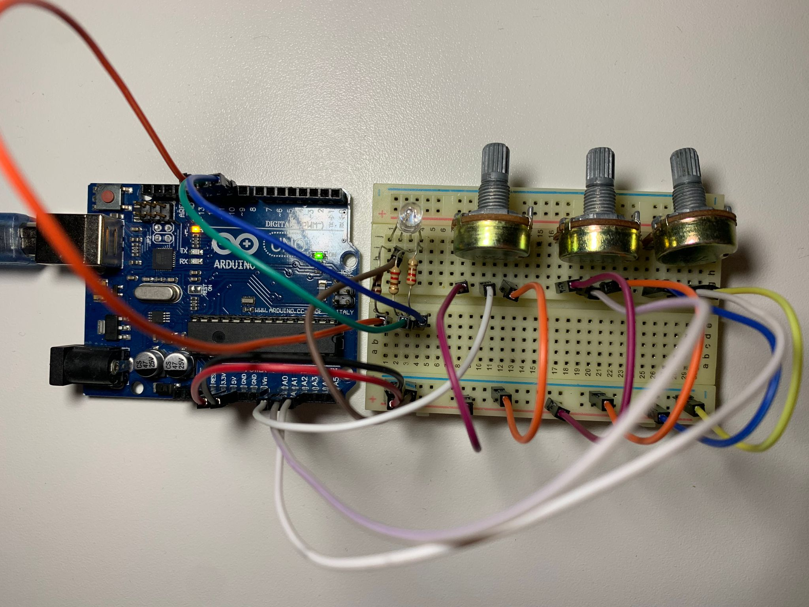

# Introduction To Robotics
This repository contains a collection of hands-on robotics assignments undertaken during my third-year studies at the Faculty of Mathematics and Computer Science, University of Bucharest. Each assignment in this repository provides clear requirements, detailed implementation instructions, and includes the code and image files necessary.

<details>
<summary>RGB LED Control Using Potentiometers</summary>
<br>
The first assignment focuses on learning how to control the colors of an RGB LED light using potentiometers. Think of an RGB LED as a tiny, controllable traffic light, where you can make it show any color you want. Potentiometers are like knobs that let you adjust the amount of red, green, and blue light the LED gives off. By turning these knobs, you can create different colors, and even mix them to create unique ones.

The components used are:
* Microcontroller (Arduino UNO)
* Breadboard
* RGB Led (at least 1)
* Potentiometers (at least 3)
* Resistors & jumper wires (as needed)

<p align="center">
  
</p>

Here's how it works:

* You have three potentiometers that you can twist. Each one represents a color channel: Red, Green, and Blue.
* When you turn the red potentiometer, it changes the intensity or brightness of the red light in the LED. Turning it more makes the red color stronger.
* Similarly, turning the green potentiometer changes the intensity of the green light, and turning the blue potentiometer changes the intensity of the blue light.
* By adjusting the three potentiometers together, you can create different colors. For example, if you turn up the red and green potentiometers while keeping the blue one low, you get a yellowish color. If you turn up only the blue potentiometer, you get a blue color.
  * [Watch the video](https://www.youtube.com/shorts/Y7U4Y1t5gCs) to see this functionality in action.
* The code in your Arduino takes the readings from the potentiometers and uses them to control the LED's colors, so it's like having a set of color knobs for your light. This way, you can experiment and create various colors by blending different amounts of red, green, and blue.

```cpp
/* This code is designed to independently manage the Red, Green, and Blue channels
of an RGB LED by utilizing separate potentiometers for each channel.*/

const int redPin = 11;   //red LED control pin
const int greenPin = 10; //green LED control pin
const int bluePin = 9;   //blue LED control pin

const int redInputPin = A0;    //analog pin for the red input (e.g., potentiometer)
const int greenInputPin = A1;  //analog pin for the green input (e.g., potentiometer)
const int blueInputPin = A2;   //analog pin for the blue input (e.g., potentiometer)

void setup() {
  pinMode(redPin, OUTPUT);
  pinMode(greenPin, OUTPUT);
  pinMode(bluePin, OUTPUT);
}

void loop() {
  //read the values from the potentiometers
  int redValue = analogRead(redInputPin);
  int greenValue = analogRead(greenInputPin);
  int blueValue = analogRead(blueInputPin);

  //map the potentiometer values to the range 0-255 for PWM
  int redBrightness = map(redValue, 0, 1023, 0, 255);
  int greenBrightness = map(greenValue, 0, 1023, 0, 255);
  int blueBrightness = map(blueValue, 0, 1023, 0, 255);

  //update the RGB LED with the new brightness values
  analogWrite(redPin, redBrightness);
  analogWrite(greenPin, greenBrightness);
  analogWrite(bluePin, blueBrightness);
}
```
</details>

<details>
<summary>Elevator Simulator</summary>
<br>
This assignment is about designing a control system that simulates a 3-floor elevator using the Arduino platform. 
The components used are:
* Microcontroller (Arduino UNO) & Breadboard
* 3 LEDs (for floor indicators)
  * each of the three LEDs symbolises one of the three floors, the LED aligned with the current floor should illuminate
* 1 LED (for operational state)
  * this LED indicates the elevator's status, blinking when the elevator is in motion and remain turned on when it's not moving.
* 3 Push Buttons (for call buttons)
  * they act as call buttons for the three different floors. Upon pressing any of these buttons, the elevator should mimic the process of moving toward the selected floor, which occurs after a brief delay of around 2-3 seconds. 
* 1 Buzzer
  * when the elevator reaches the requested floor, the buzzer emits a short sound similar to a "cling!"
  * when the elevator doors close and it starts moving
* Resistors (220-330 Ohms for LEDs) & Jumper Wires

<p align="center">
  
</p>

The code continuously checks the status of the call buttons, and when a button is pressed, it initiates elevator movement to the desired floor. The elevator doors open and close with corresponding buzzer sounds. During the elevator's movement, the operational LED blinks to indicate motion, and the buzzer emits a sound similar to an elevator that is in motion. Floor indicator LEDs show the current floor by lighting up. 

[Watch the video](https://www.youtube.com/shorts/97vl4IrVoe4) to see this project in action.

```cpp
const int floorLeds[] = {2, 3, 4};  //digital pins for floor indicator LEDs
const int operationalLed = 5;       //digital pin for the operational state LED
const int buzzerPin = 6;            //digital pin for the buzzer
const int buttonPins[] = {7, 8, 9}; //digital pins for call buttons

int currentFloor = 1; //current floor of the elevator
const int delayTime = 1000;

bool isMovingToFloor = false;
int targetFloor = -1;

int buzzTone = 1000;
const int soundDuration = 500;

const int debounceDelay = 100;
unsigned long lastDebounceTime[] = {0, 0, 0};
bool buttonState[] = {false, false, false};
bool lastButtonState[] = {false, false, false};

byte ledState = HIGH; //could be bool
unsigned long previousMillis = 0;
const long interval = 500; //interval at which to blink (milliseconds)

void setup() {
  for(int i=0; i<3; i++) {
    pinMode(floorLeds[i], OUTPUT);
    pinMode(buttonPins[i], INPUT_PULLUP);
  }

  digitalWrite(floorLeds[0], HIGH); 
  digitalWrite(floorLeds[1], LOW);
  digitalWrite(floorLeds[2], LOW);

  pinMode(operationalLed, OUTPUT);
  digitalWrite(operationalLed, HIGH);

  pinMode(buzzerPin, OUTPUT);
}

void loop() {
  for(int i=0; i<3; i++) {
    int reading = digitalRead(buttonPins[i]);

    if(reading != lastButtonState[i]) {
      lastDebounceTime[i] = millis();
    }

    if((millis() - lastDebounceTime[i]) > debounceDelay) {
      if(reading != buttonState[i]) {
        buttonState[i] = reading;
        if(buttonState[i] == LOW) {
          handleButtonPress(i + 1);
        }
      }
    }

    lastButtonState[i] = reading;
  }
}

void handleButtonPress(int desiredFloor) {
  if(desiredFloor == currentFloor || (isMovingToFloor && desiredFloor == targetFloor)) {
    //elevator is already on the desired floor or it's already moving to that floor
    return;
  }

  if(!isMovingToFloor) {
    //if the elevator is not already moving, initiate the movement
    targetFloor = desiredFloor;
    isMovingToFloor = true; //elevator has started moving
    
    doorsSound();
    delay(delayTime); //doors closing
    
    moveElevator(targetFloor);
    doorsSound(); //doors opening
    digitalWrite(operationalLed, HIGH);

    isMovingToFloor = false; //elevator has stopped moving
  }
}

void moveElevator(int floor) {
  unsigned long lastFloorTime = 0;
  const unsigned long floorChangeInterval = 2000; //2 seconds between floors

  //simulate elevator movement to the target floor
  if (floor > currentFloor) {
    for (int i = currentFloor; i < floor; i++) {
      currentFloor = i + 1;
      lastFloorTime = millis();
      while (millis() - lastFloorTime < floorChangeInterval) {
        elevatorMovingSound();
        blinkOperationalLED();
      }
      updateFloorIndicators();
      
    }
  }else if(floor < currentFloor) {
    for(int i = currentFloor; i > floor; i--) {
      currentFloor = i - 1;
      lastFloorTime = millis();
      while (millis() - lastFloorTime < floorChangeInterval) {
        elevatorMovingSound();
        blinkOperationalLED();
      }
      updateFloorIndicators();
    }
  }

  // Simulate elevator doors
  doorsSound();
  delay(delayTime); //pause
}


void updateFloorIndicators() {
  for (int i=0; i<3; i++) {
    digitalWrite(floorLeds[i], i + 1 == currentFloor ? HIGH : LOW);
  }
}

void doorsSound() {
  tone(buzzerPin, 440, soundDuration); //sound for elevator doors opening/closing
}

void elevatorMovingSound() {
  tone(buzzerPin, 1000); //sound the buzzer at 1000 Hz while moving
}

void blinkOperationalLED() {
  unsigned long currentMillis = millis();
  if (currentMillis - previousMillis >= interval) {
    //save the last time the LED state was toggled
    previousMillis = currentMillis;

    //toggle the LED state (HIGH to LOW, or LOW to HIGH)
    if (ledState == HIGH) {
      ledState = LOW;
    } else {
      ledState = HIGH;
    }

    digitalWrite(operationalLed, ledState);  // Apply the new LED state
  }
}
```
</details>

<details>
<summary>7 segment display drawing</summary>
<br>
This project uses a joystick and a button to control a 7 segment display. The joystick allows you to move a segment around the display, like drawing with a virtual pen. You can't move through "walls," so it jumps to neighboring spots. The button lets you turn the segment on or off with a quick press. If you hold the button down for a while, it clears the display and puts the segment back at the starting point.

Components used:
* Microcontroller (Arduino UNO) & Breadboard
* 1 7-Segment Display
* 1 Joystick
* Resistors (220-330 Ohms for LEDs) & Jumper Wires

| Current segment  |  UP  | DOWN | LEFT | RIGHT |
| ---------------- | ---- | ---- | ---- | ----- |
|        a         | N/A  |   g  |  f   |   b   |
|        b         |  a   |   g  |  f   |  N/A  |
|        c         |  g   |   d  |  e   |  dp   |
|        d         |  g   | N/A  |  e   |   c   |
|        e         |  g   |   d  | N/A  |   c   |
|        f         |  a   |   g  | N/A  |   b   |
|        g         |  a   |   d  | N/A  |  N/A  |
|       dp         | N/A  | N/A  |  c   |  N/A  |

The following code begins by declaring pin connections for the joystick (analog inputs for X and Y axes and a digital input for the switch) and the 7-segment display (an array of pins for segments and a pin for the decimal point). The code initializes the display and continuously reads the joystick input, allowing you to move a selected segment's position on the display based on the joystick's X and Y values. It also handles button presses: short presses toggle the state of the current segment (ON or OFF), and long presses reset the entire display. The code supports both common anode and common cathode displays.

```cpp
// declare all the joystick pins
const int pinSW = 2; // digital pin connected to switch output
const int pinX = A0; // A0 - analog pin connected to X output
const int pinY = A1; // A1 - analog pin connected to Y output

// declare all the segments pins
const int pinA = 12;
const int pinB = 10;
const int pinC = 9;
const int pinD = 8;
const int pinE = 7;
const int pinF = 6;
const int pinG = 5;
const int pinDP = 4;

const int segSize = 8;
int index = 7; // Start at the decimal point position

bool commonAnode = false;
byte state = HIGH;
byte swState = LOW;
byte lastSwState = LOW;
int xValue = 0;
int yValue = 0;
bool joyMoved = false;

```
</details>
